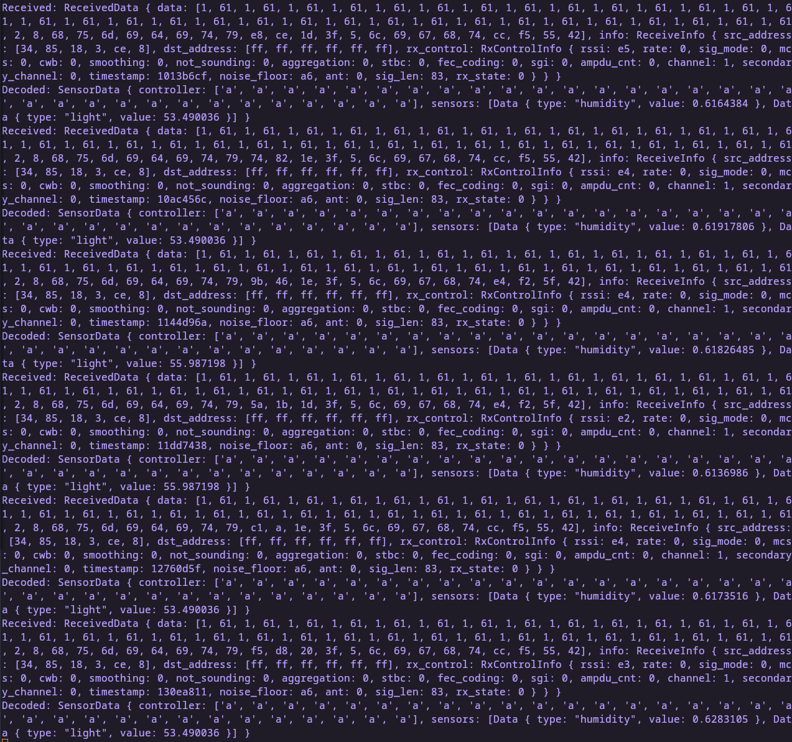

# ESP-Gateway

This is a simple gateway to forward data from ESP-Now to http for the Project PlantBuddy. It runs on an ESP32C3.

## Requirements
- [Rustup](https://rustup.rs/)

## Setup

### esp-firmware
1. Install espflash
2. `cd esp-firmware`
3. Switch to Rust nightly using `rustup override set nightly`
4. Run `cargo run --release` to build and flash the firmware

### serial-forwarder
1. `cd serial-forwarder`
2. Install espmonitor via `cargo install espmonitor`
3. `cargo run --release` to build and run the serial-forwarder

## Adapting for your own use case

If you want to reuse this code for your own use case, you need to change the following things:

Change the data structures in `esp-firmware/src/main.rs` and `serial-forwarder` to match your own data
## Example Output

## Structure

The gateway is intentionally split into two parts, one being the ESP acting as a receiver that also decodes the messages(since Linux does not have ESP-Now support and patching the Linux kernel to do so via another project that might not work anymore with newer kernels was really not in scope). And also because it would be hard currently to do HTTPS on the ESP32C3 using esp-hal. 

The other part is the actual gateway that runs on Linux and receives the data from the ESP via serial, does a small transformation and forwards it to the backend via http.